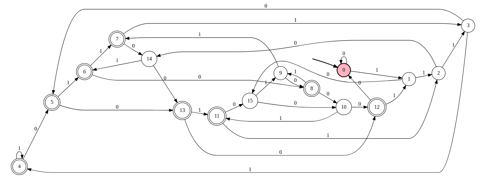

# 불필요한 객체 생성을 피하라
객체를 매번 생성하지 않고 재사용하여 좋은 경우를 다뤄보자.

## 문자열 객체 생성

~~~java
// case 1
String s = new String("apple");

// case 2
String s = "apple";
~~~

case 1 의 경우 실행될 때마다 String 인스턴스를 새로 만든다.  
case 2 의 경우 하나의 String 인스턴스를 생성한다.      
  
## static 팩터리 메소드

자바 9에서 deprecated 된 `Boolean(String)` 생성자 대신 `Boolean.valueOf(String)` 팩터리 메소드를 사용할 수 있다.  
생성자는 호출할 때 마다 새로운 객체를 만들지만, 팩터리 메소드는 그렇지 않다.

## 비싼 객체는 캐싱해서 재사용하라

정규표현식을 예제로 들어보자.  
`String` 의 `matches` 메소드는 내부적으로 `Pattern` 의 `matches` 메소드를 실행시킨다.  
  
```java
// String.class
public boolean matches(String regex) {
    return Pattern.matches(regex, this);
}
```
  
`Pattern` 의 `matches` 는 `compile` 메소드에 regex를 넘겨 지정된 정규표현식을 컴파일 하며 `Pattern` 객체를 생성한다.
```java
// Pattern.class
public static boolean matches(String regex, CharSequence input) {
    Pattern p = Pattern.compile(regex);
    Matcher m = p.matcher(input);
    return m.matches();
}

public static Pattern compile(String regex) {
    return new Pattern(regex, 0);
}
```
  
위의 코드가 실행되면 정규표현식용 `Pattern` 인스턴스가 생성되며 한 번 쓰고 버려져서 곧바로 가비지 컬렉션 대상이 된다.
`Pattern` 은 입력받은 정규표현식에 해당하는 `유한 상태 머신`을 만들기 때문에 인스턴스 생성 비용이 높다.

### 유한 상태 머신 이란?

그래프 형태로 노드는 시작, 도착 상태를 포함한 상태이고 엣지는 상태 사이의 전이를 나타낸다.  
예를들어 0, 1로 이루어진 문자열 중 마지막에서 네번째 문자가 1인 문자열을 표현하는 정규표현식은 `(0|1)*1(0|1){3}` 이고, 아래는 해당 정규표현식을 나타낸 유한 상태 머신이다.  

<center></center>

### 성능 개선

필요한 정규표현식을 표현하는 `Pattern` 인스턴스를 정적 초기화 과정에서 `private static final`로 캐싱해둔다.  
```java
public class RomanNumerals{
    private static final Pattern ROMAN = Pattern.compile("^(?=.)M*(C[MD]|D?C{0,3})(X[CL]|L?X{0,3})(I[XV]|V?I{0,3})$");

    static boolean isRomanNumeral(String s) {
        return ROMAN.matcher(s).matches();
    }
}
```

## 어댑터

불변 객체의 경우 재사용해도 안전하지만 몇몇 경우에 분명하지 않은 경우가 있다.  
`어댑터`를 예로 들면, 어댑터는 인터페이스를 통해서 뒤에 있는 객체로 연결해주는 객체이기 때문에 뒷단 객체 당 하나의 어댑터면 충분하다.  
  
`Map` 인터페이스의 `KeySet` 메서드는 `Map` 객체 안의 모든 키를 담은 `Set` 뷰를 반환한다.  
`KeySet` 을 호출할 때마다 같은 `Set` 인스턴스를 반환한다.  
따라서 뷰 객체를 여러 개 만들어도 상관은 없지만, 그럴 필요도 없고 이득도 없다.  

```java
public class UsingKeySet {

    public static void main(String[] args) {
        Map<String, Integer> menu = new HashMap<>();
        menu.put("Burger", 8);
        menu.put("Pizza", 9);

        Set<String> names1 = menu.keySet();
        Set<String> names2 = menu.keySet();

        names1.remove("Burger");
        System.out.println(names2.size()); // 1
        System.out.println(menu.size()); // 1
    }
}
```

## 오토박싱

불필요한 객체를 생성하는 또 다른 방법이다.
오토박싱은 프로그래머가 `Primitive 타입`과 `Box 타입`을 섞어 쓸 때 자동으로 상호 변환해주는 기술이다.
오토박싱은 `Primitive` 타입과 `Box 타입` 의 경계가 안보이게 해주지만 그렇다고 그 경계를 없애주진 않는다.

```java
private static long sum() {
    Long sum = 0l;
    for (long i = 0 ; i <= Integer.MAX_VALUE ; i++) {
        sum += i;
    }
    return sum;
}
```
위 코드에느 sum 변수의 타입을 Long 으로 선언해서 불필요한 Long 인스턴스가 약 2의 31 제곱만큼 만들어진다.

불필요한 오토박싱을 피하려면 `박스 타입` 보다는 `Primitive 타입`을 사용해야한다.  

## 결론
기존 객체를 재사용해야 한다면 새로운 객체를 만들지 마라.  

반면 불필요한 객체 생성은 피하는 것이 좋지만, 이는 그저 코드 형태와 성능에만 영향을 준다.  
요즘의 JVM 에서는 작은 객체를 생성하고 회수하는 일이 큰 부담이 되지 않는다.  
만약 방어적 복사가 필요한 상황에서 객체를 재사용한다면 심각한 버그와 보안성에 문제가 생기므로 주의하도록 한다.

## 참고

- https://github.com/java-squid/effective-java/tree/master/chapter02/item06
- https://velog.io/@byeongju/%EC%A0%95%EA%B7%9C%ED%91%9C%ED%98%84%EC%8B%9D%EC%9D%84-%EA%B2%80%EC%82%AC%EB%A5%BC-%EB%8D%94-%ED%9A%A8%EC%9C%A8%EC%A0%81%EC%9C%BC%EB%A1%9C-%ED%95%B4%EB%B3%B4%EC%9E%90
- https://www.youtube.com/watch?v=0yUxPUXS1pM&list=PLfI752FpVCS8e5ACdi5dpwLdlVkn0QgJJ&index=6
