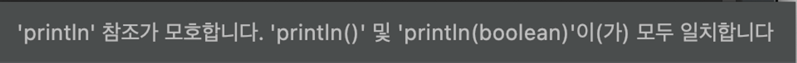

# 다중정의는 신중히 사용하라
다중정의, 즉 `overloading`은 어느 메서드를 호출할 지가 컴파일 타임에 정해지기 때문에 사용 시 주의해야한다.

다음은 컬렌션을 집합, 리스트 그 외로 구분하고자 만든 프로그램이다.

## 다중정의 사용
```java
public class CollectionClassifier {
    public static String classify(Set<?> s) {
        return "집합";
    }
    public static String classify(List<?> lst) {
        return "리스트";
    }
    public static String classify(Collection<?> c) {
        return "그 외";
    }
    public static void main(String[] args) {
        Collection<?>[] collections = {
                new HashSet<String>(),
                new ArrayList<BigInteger>(),
                new HashMap<String, String>().values()
        };
        
        for(Collection<?> c : collections) {
            System.out.println(classify(c));
        }
    }
}
```
위 코드를 실제 수행했을 때 "그 외"만 세 번 연달아 출력한다.  
다중정의는 컴파일 타임에 어느 메서드를 호출할 지 정해지며, 컴파일 타임에 for 문 안의 c는 항상 Collection<?> 타입이기 때문이다.

하지만 재정의한 메서드는 객체의 런타임 타입이 어떤 메서드를 호출할지의 기준이 된다.  
따라서 **재정의한 메서드는 동적으로 선택되고, 다중정의한 메서드는 정적으로 선택된다.**

## 재정의된 메서드 호출 메커니즘 사용
```java
class Wine {
    String name() { return "포도주"; }
}

class SparklingWine extends Wine {
    @Override String name() { return "발포성 포도주"; }
}

class Champagne extends Wine {
    @Override String name() { return "샴페인"; }
}

public class Overriding {
    public static void main(String[] args) {
        List<Wine> wineList = List.of(
                new Wine(), new SparklingWine(), new Champagne();
        );
        
        for(Wine wine : wineList)
            System.out.println(wine.name());
    }
}
```
이 프로그램은 "포도주", "발포성 포도주", "샴페인"을 차례로 출력한다.

## 다중정의 + instanceof 사용
다중정의를 사용하며 재정의 시 처럼 런타입 타입에 기초해 메서드 호출을 하고 싶을 경우, (정적 메서드를 사용해도 좋다면) CollectionClassifier의 모든 classify 메서드를 하나로 합친 후 instanceof 로 명시적으로 검사하면 해결된다.
```java
public static String classify(Collection<?> c) {
    return c instanceof Set  ? "집합":
           c instanceof List ? "리스트": "그 외";
}
```

## 다중정의 사용 시 주의점
### 안전하고 보수적으로 가려면 매개변수 수가 같은 다중정의는 만들지 말자.
- 가변인수(varargs)를 사용하는 메서드는 다중정의를 하지 말자.  
- 매개변수가 같아야 한다면, 메서드 이름을 다르게 짓는게 낫다.  
    > 예를들어, `ObjectOutputStream` 클래스의 `write` 메서드는 `writeBoolean`, `writeInt`, `writeLong` 같은 형식이다.  
`read` 메서드도 이에 맞춰 `readBoolean`, `readInt`, `readLong` 같은 형식이라 짝을 맞추기 좋다. 
### 생성자를 여러개 만들 경우 무조건 다중정의가 된다.  
생성자는 이름을 다르게 지을 수 없으니 두 번째 생성자부터는 무조건 다중정의가 된다.
### 매개변수 수가 같은 다중정의 메서드가 많더라도, 매개변수 중 하나 이상이 **근본적으로 다르다**면 헷갈릴 일이 없다.  
근본적으로 다르다는 건 **두 타입의 값을 서로 어느 쪽으로든 형변환할 수 없다는 뜻**이다. (null 제외)  
자바 4까지는 모든 기본 타입이 모든 참조 타입과 근본적으로 달랐지만, 자바 5에서 **오토박싱**이 도입되면서 평화롭던 시대가 막을 내렸다.  

다음 프로그램을 살펴보자.
```java
public class SetList {
    public static void main(String[] args) {
        Set<Integer> set = new TreeSet<>();
        List<Integer> list = new ArrayList<>();

        for (int i = -3; i < 3; i++) {
            set.add(i);
            list.add(i);
        }
        
        for (int i = 0; i < 3; i++) {
            set.remove(i);
            list.remove(i);
        }
        System.out.println(set + " " + list);
    }
}
```
이 프로그램은 음이 아닌 0, 1, 2를 제거한후 `"[-3, -2, -1] [-3, -2, -1]"`을 출력할 것으로 예상할 것이다.  
하지만 실제로는 `"[-3, -2, -1] [-2, 0, 2]"`를 출력한다.

`set.remove(i)`의 시그니처는 `remove(Object)`다.  
다중정의된 다른 메서드가 없어 기대한 대로 동작하여 집합에서 0 이상의 수들을 제거한다.

한편, `list.remove(i)`는 다중정의된 `remove(int index)`를 선택한다.  
해당 메서드는 "지정한 위치" 의 원소를 제거하는 기능을 수행하기 때문에, `[-2, 0, 2]`가 남는다.  
따라서 이 문제는 `List.remove`의 인수를 `Integer`로 형변환하여 올바른 다중정의 메서드를 선택하게 하면 해결된다.  
```java
for (int i = 0; i < 3; i++) {
    set.remove(i);
    list.remove((Integer) i);   // 혹은 remove(Integer.valueOf(i))
}
```
이 문제는 `List<E>` 인터페이스가 `remove(Object)`와 `remove(int)`를 다중정의했기 때문이다.  

제네릭이 도입되기 전인 자바 4까지의 List에서는 Object와 int가 근본적으로 달라서 문제가 없었다.  
그런데 제네릭과 오토박싱이 등장하며 두 메서드의 매개변수 타입이 더는 근본적으로 다르지 않게 되었다.

### 서로 다른 함수형 인터페이스라도 같은 위치의 인수로 받아서는 안된다.
자바 8에서 도입한 람다와 메서드 참조 역시 다중정의 시 혼란을 키웠다.
```java
// 1. Thread의 생성자 호출
new Thread(System.out::println).start();

// 2. ExecutorService의 submit 메서드 호출
ExecutorService exec = Executors.newCachedThreadPool();
exec.submit(System.out::println);
```
둘 다 스레드를 할당해 콘솔 출력을 하는 로직이지만, `exec.submit()` 메서드에서만 아래의 컴파일 오류 메세지가 발생한다.  


이는 **`println()` 메서드와 `submit()` 메서드가 모두 다중정의 되어있기 때문이다.**   
ExecutorService의 submit 메서드는 Callable<T> 를 받는 것과 Runnable을 받는 것을 다중정의 했다.  
따라서 적절한 다중정의 메서드를 찾는 알고리즘인, `다중정의 해소 알고리즘`에서 정상적으로 다중정의 메서드를 선택할 수 없기에 생기는 문제이다.

기술적으로 말하면 `System.out::println`은 부정확한 메서드 참조(inexact method reference) 이다.  
이러한 부정확한 메서드 참조같은 인수표현식은 목표 타입이 선택되기 전에는 의미가 정해지지 않아 적용성 테스트(applicability test)때 무시되는데, 이게 문제의 원인이 된다.

핵심은 다중정의 된 메서드(혹은 생성자)들이 함수형 인터페이스를 인수로 주고 받을 때, 비록 서로 다른 함수형 인터페이스라도 인수 위치가 같으면 혼란이 생긴다는 것이다.  
이 말은 서로 다른 함수형 인터페이스라도 서로 근본적으로 다르지 않다는 뜻이다.  
함수형 인터페이스를 API에서 사용할 때는 오버로딩을 사용하면 안된다.

## 결론
프로그래밍 언어가 다중정의를 허용한다고 해서 다중정의를 꼭 활용하라는 뜻은 아니다  
일반적으로 매개변수 수가 같을 때는 다중정의를 피하는 게 좋다.  
상황에 따라, 특히 생성자라면 이 조언을 따르기가 불가능할 수 있다.  
그럴 때는 헷갈릴 만한 매개변수는 형변환하여 정확한 다중정의 메서드가 선택되도록 해야한다.  

## 참조
- https://catsbi.oopy.io/1b439cd5-58aa-4cb1-a715-2bfa66afc72a