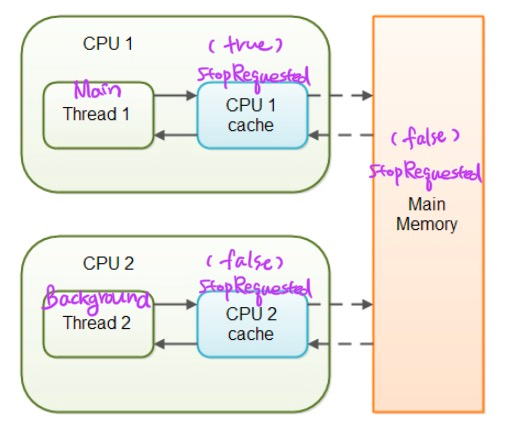

# 공유 중인 가변 데이터는 동기화해 사용하라
## synchronized
`synchronized` 키워드는 아래 두가지를 보장한다.
- **배타적 실행**
  - 해당 메서드나 블록을 한번에 한 스레드씩 수행하도록 보장한다.
- **스레드 사이의 안정적인 통신**
  - 동기화된 메서드나 블록에 들어간 스레드가 같은 락의 보호하에 수행된 모든 이전 수정의 최종 결과를 보게 해준다.

많은 프로그래머가 동기화를 배타적 실행, 즉 한 스레드가 변경하는 중이라서 상태가 일관되지 않은 순간의 객체를 다른 스레드가 보지 못하게 막는 용도로만 생각한다.  
하지만 동기화에는 중요한 기능이 하나 더 있다.  
동기화 없이는 한 스레드가 만든 변화를 다른 스레드에서 확인하지 못할 수 있다.

## 원자성 (atomic)
언어 명세상 `long`과 `double`외의 변수를 읽고 쓰는 동작은 원자적이다.  
여러 스레드가 같은 변수를 동기화 없이 수정하는 중이라도, 항상 어떤 스레드가 정상적으로 저장한 값을 온전히 읽어옴을 보장한다는 뜻이다.  

그렇다면, **성능을 높이기 위해 원자적 데이터를 읽고 쓸 때는 동기화하지 않아도 될까?**  
답은 아니다.  
자바 언어 명세는 스레드가 필드를 읽을 때 항상 '수정이 완전히 반영된'값을 얻는다고 보장하지만, 한 스레드가 저장한 값이 다른 스레드에게 '보이는가'
는 보장하지 않는다.  
**동기화는 배타적 실행뿐 아니라 스레드 사이의 안정적인 통신에 꼭 필요하다.**

이는 한 스레드가 만든 변화가 다른 스레드에게 언제 어떻게 보이는지를 규정한 **자바의 메모리 모델** 때문이다.

## 다른 스레드를 멈추는 방법
공유 중인 가변 데이터를 원자적으로 읽고 쓸 수 있을지라도 동기화에 실패하면 처참한 결과로 이어질 수 잇다.  
다른 스레드를 멈추는 작업을 생각해보자.  
`Thread.stop` 메서드는 안전하지 않아 이미 오래전에 deprecated API로 지정되었다. **그러니 `Thread.stop`은 사용하지 말자!**  
```java
public class StopThread {
    private static boolean stopRequested;
    
    public static void main(String[] args) throws InterruptedException {
        Thread backgroundThread = new Thread(() -> {
            int i = 0;
            while(!stopRequested) {
                i++;
            }
        });
        backgroundThread.start();
        
        TimeUnit.SECONDS.sleep(1);
        stopRequested = true;
    }
}
```
위 코드를 보면 메인 스레드가 1초 후 `stopRequested`를 `true`로 설정하여 백그라운드 스레드가 반복문을 빠져나올 것처럼 보인다.  
하지만 **응답 불가(liveness failure)** 상태에 빠진다.

이는 메인 스레드가 수정한 `stopRequested` 값을 백그라운드 스레드가 언제 보게 될지 보장할 수 없기 때문이다.  
배타적 실행은 보장되지만, **스레드 사이의 안정적인 통신이 보장되지 않는 상황이다.**

### 자바 메모리 모델
멀티 스레드 환경에서는 각 스레드 별로 할당 된 `CPU Cache`로 데이터를 불러와 사용한다.  
각각의 `CPU Cache`에 저장된 데이터가 다를 수 있기 때문에 `값 불일치 문제`가 발생할 수 있다.  



### 호이스팅(hoisting)
동기화가 빠지면 가상머신이 다음과 같은 의도와 다른 최적화를 수행할 수도 있다.  
```java
// 원래 코드
while (!stopRequested)
    i++;
// 최적화한 코드
if (!stopRequested)
    while(true)
        i++;
```
OpenJDK 서버 VM이 실제로 적용하는 끌어올리기(hoisting)라는 최적화 기법이다. 이 결과 프로그램은 응답 불가 상태가 된다.   

이 문제를 어떻게 동기화해야 할까?  
위에서 언급한 `synchronized` 키워드를 사용하는 방법과 `volatile` 이라는 키워드를 이용하는 방법이 있다.
### 1. synchronized 사용
```java
public class StopThread {
    private static boolean stopRequested;
    
    private static synchronized void requestStop() {
        stopRequested = true;
    }
    
    private static synchronized boolean stopRequested() {
        return stopRequested;
    }

    public static void main(String[] args) throws InterruptedException {
        Thread backgroundThread = new Thread(() -> {
            int i = 0;
            while(!stopRequested()) {
                i++;
            }
        });
        backgroundThread.start();

        TimeUnit.SECONDS.sleep(1);
        requestStop();
    }
}
```
쓰기 메서드(requestStop)와 읽기 메서드(stopRequested) 모두를 동기화함으로써 문제를 해결할 수 있다.  
**쓰기와 읽기 모두가 동기화되지 않으면 동작을 보장하지 않는다.**
다만 이 코드는 동기화의 배타적 수행과 스레드 간 통신 기능 중 **통신 목적**으로만 사용된 것이다.

### 2. volatile 사용
`volatile` 사용 시 문제를 더 빠른 속도로 해결할 수 있다.  
자바 변수를 `메인 메모리`에 저장하겠다고 명시해주는 것이다.  
따라서 동기화는 아니지만 항상 가장 최근에 기록된 값을 읽게 됨을 보장한다.
즉, 동기화의 배타적 수행이 아닌 안정적 통신만 제공한다.
```java
public class StopThread {
    private static volatile boolean stopRequested;

    public static void main(String[] args) throws InterruptedException {
        Thread backgroundThread = new Thread(() -> {
            int i = 0;
            while(!stopRequested) {
                i++;
            }
        });
        backgroundThread.start();

        TimeUnit.SECONDS.sleep(1);
        stopRequested = true;
    }
}
```
#### `volatile` 사용 시 주의할 점
예를 들어 다음은 매번 고유한 일련번호를 생성할 의도로 작성된 메서드이다.  
```java
private static volatile int nextSerialNumbet = 0;

public static int generateSerialNumber(){
    return nextSerialNumber++;
}
```
굳이 동기화하지 않더라도 불변식을 보호할 수 있어 보이지만, 이 역시 동기화 없이는 올바로 동작하지 않는다.  

**문제는 증가 연산자(++)다.**  
먼저 값을 읽고, 그런다음 1 증가한 새로운 값을 저장한다.  
만약 두 번째 스레드가 이 두 접근 사이를 비집고 들어와 값을 읽어가면 첫 번째 스레드와 똑같은 값을 돌려받게 된다.  
프로그램이 잘못된 결과를 계산해내는 이런 오류를 안전 실패(safety failure)라고 한다.

`generateSerialNumber` 메서드에 `synchronized` 한정자를 붙이고, `volatile`을 제거하면 문제가 해결된다.  
이 메서드를 더 견고하게 하려면 `int` 대신 `long`을 사용하거나 `nextSerialNumber`가 최댓값에 도달하면 예외를 던지게 하자.

### AtomicLong
`java.util.concurrent.atomic` 패키지의 `AtomicLong`을 사용해보자.  
이 패키지에는 락 없이도 스레드 안전한 프로그래밍을 지원하는 클래스들이 담겨 있다.  
`volatile`은 동기화의 두 효과 중 통신 쪽만 지원하지만 이 패키지는 원자성(배타적 실행)까지 지원한다.  
더구나 성능도 동기화 버전보다 우수하다.

## 가장 좋은 방법
애초에 가변 데이터를 멀티 스레드 환경에서 사용하지 않고, 단일 스레드에서만 쓰도록 하는 것이다.  
한 스레드가 데이터를 다 수정한 후 다른 스레드에 공유할 때는 해당 객체에서 공유하는 부분만 동기화해도 된다.  
그러면 그 객체를 다시 수정할 일이 생기기 전까지 다른 스레드들은 동기화 없이 자유롭게 값을 읽어갈 수 있다.  
이런 객체를 사실상 불변(effectively immutable)이라 하고 다른 스레드에 이런 객체를 건네는 행위를 안전 발행(safe publication)이라 한다.  

객체를 안정하게 발행하는 방법은 많다.  
클래스 초기화 과정에서 객체를 정적 필드, `volatile` 필드, `final` 필드, 혹은 보통의 락을 통해 접근하는 필드에 저장해도 된다.  
그리고 동시성 컬렉션에 저장하는 방법도 있다.

## 결론
- 되도록 가변 데이터를 멀티 스레드 환경에서 사용하지 말자.  
- 그래도 사용해야 한다면 데이터를 읽고 쓰는 동작 시 반드시 동기화 하자.
  - 읽기/쓰기 둘 다 동기화 하지 않으면 동작을 보장하지 않는다.
  - 통신 동작만 수행한다면 `volatile`으로도 충분하다.
  - 그게 아니라 배타적 실행까지 되어야한다면 `synchronized` 혹은 `java.util.concurrent.atomic` 패키지를 활용한다.
- 공유되는 가변 데이터를 동기화하는 데 실패하면 응답 불가 상태에 빠지거나 안전 실패로 이어질 수 있다.  

## 참조
- https://programmer-ririhan.tistory.com/417
- https://catsbi.oopy.io/a30cbbc8-3788-44e2-847d-f9adf9800480